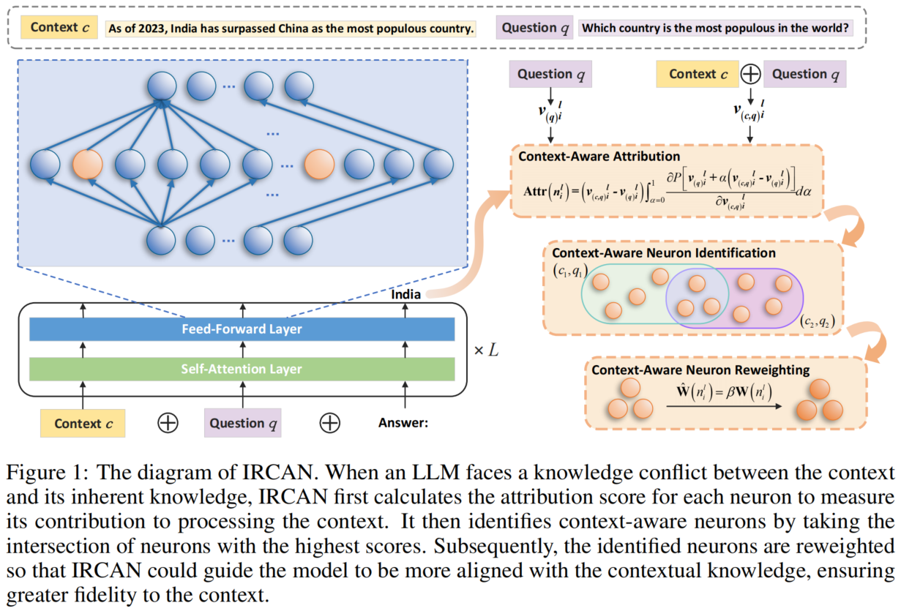

# IRCAN: Mitigating Knowledge Conflicts in LLM Generation via Identifying and Reweighting Context-Aware Neurons

<p align="center">
    <a href="#introduction">Introduction</a> •
    <a href="#overview">Overview</a> •
    <a href="#how-to-run">How to Run</a> •
    <a href="#citation">Citation</a> •
    <a href="#contact">Contact</a>
</p>


Official Code Repository for the paper [**IRCAN: Mitigating Knowledge Conflicts in LLM Generation via Identifying and Reweighting Context-Aware Neurons**](https://arxiv.org/abs/2406.18406) (**NeurIPS 2024**).

## Introduction

It is widely acknowledged that large language models (LLMs) encode a vast reservoir of knowledge after being trained on mass data. Recent studies disclose knowledge conflicts in LLM generation, wherein outdated or incorrect parametric knowledge (i.e., encoded knowledge) contradicts new knowledge provided in the context. To mitigate such knowledge conflicts, we propose a novel framework, IRCAN (Identifying and Reweighting Context-Aware Neurons) to capitalize on neurons that are crucial in processing contextual cues. Specifically, IRCAN first identifies neurons that significantly contribute to context processing, utilizing a context-aware attribution score derived from integrated gradients. Subsequently, the identified context-aware neurons are strengthened via reweighting. In doing so, we steer LLMs to generate context-sensitive outputs with respect to the new knowledge provided in the context. Extensive experiments conducted across a variety of models and tasks demonstrate that IRCAN not only achieves remarkable improvements in handling knowledge conflicts but also offers a scalable, plug-and-play solution that can be integrated seamlessly with existing models.


## Overview




## How to Run


### Completion task

#### 1. Calculate the Context-Aware Attribution

```
bash src/1_run_calculate_completion_Memo_llama2-7b.sh 0
```

#### 2. Process Context-Aware Neurons

```
bash src/2_run_get_cns_Memo_llama2-7b.sh
```

#### 3. Reweight Context-Aware Neurons and Evaluate Models

(1) Run grid search to identify the optimal hyperparameters: $h$ (the number of identified context-aware neurons) and $β$ the enhancement strength

```
bash src/3_run_dev_Memo_llama2-7b.sh 0
```

(2) Evaluate IRCAN

Please set the optimal hyperparameters $h$ and $β$ first in `src/4_run_test_Memo_enhanced_llama2-7b.sh`, then run it to evaluate IRCAN.

```
bash src/4_run_test_Memo_enhanced_llama2-7b.sh 0
```

If you want to compare the performance with the vanilla model, run the following code to get the results of the origin model.

```
bash src/4_run_test_Memo_origin_llama2-7b.sh 0
```

(3) Evaluate the model that integrates IRCAN and CAD ([context-aware decoding](https://arxiv.org/abs/2305.14739))

CAD amplifies the difference between output probabilities with and without context, encouraging the LLM to attend to its context during generation.

Since this method and our approach work in completely different ways: CAD manipulates the model’s final output probabilities, while IRCAN focuses on identifying and enhancing neurons responsible for processing the context, these two methods can be seamlessly combined without any obstacles. We also conducted experiments combining the two methods.

To evaluate the model that integrates IRCAN and CAD, simply add the `--use_cad_decoding` parameter to the three bash scripts above.

(4) Ablation Studies

If you want to conduct the ablation experiments, i.e. erasing the detected context-aware neurons, enhancing randomly selected neurons, and erasing randomly selected neurons. 

```
bush src/5_run_test_Memo_randomly_enhanced_llama2-7b.sh 0
```


### Multiple-choice Task

#### 1. Calculate the Context-Aware Attribution

```
bash src/1_run_calculate_mcq_COSE_llama2-7b-chat.sh 0
```

#### 2. Process Context-Aware Neurons

```
bash src/2_run_get_cns_COSE_llama2-7b-chat.sh
```

#### 3. Reweight Context-Aware Neurons and Evaluate Models

(1) Run grid search to identify the optimal hyperparameters: $h$ (the number of identified context-aware neurons) and $β$ the enhancement strength

```
bash src/3_run_dev_COSE_llama2-7b-chat.sh 0
```

(2) Evaluate IRCAN

Please set the optimal hyperparameters $h$ and $β$ first in `src/4_run_test_COSE_enhanced_llama2-7b-chat.sh`, then run it to evaluate IRCAN.

```
bash src/4_run_test_COSE_enhanced_llama2-7b-chat.sh 0
```

If you want to compare the performance with the vanilla model, run the following code to get the results of the origin model.

```
bash src/4_run_test_COSE_origin_llama2-7b-chat.sh 0
```

(3) Evaluate the model that integrates IRCAN and CAD ([context-aware decoding](https://arxiv.org/abs/2305.14739))

CAD amplifies the difference between output probabilities with and without context, encouraging the LLM to attend to its context during generation.

Since this method and our approach work in completely different ways: CAD manipulates the model’s final output probabilities, while IRCAN focuses on identifying and enhancing neurons responsible for processing the context, these two methods can be seamlessly combined without any obstacles. We also conducted experiments combining the two methods.

To evaluate the model that integrates IRCAN and CAD, simply add the `--use_cad_decoding` parameter to the three bash scripts above.

(4) Ablation Studies

If you want to conduct the ablation experiments, i.e. erasing the detected context-aware neurons, enhancing randomly selected neurons, and erasing randomly selected neurons. 

```
bush src/5_run_test_COSE_randomly_llama2-7b-chat.sh 0
```


## Citation
```
@misc{shi2024ircan,
    title={IRCAN: Mitigating Knowledge Conflicts in LLM Generation via Identifying and Reweighting Context-Aware Neurons},
    author={Dan Shi, Renren Jin, Tianhao Shen, Weilong Dong, Xinwei Wu, Deyi Xiong},
    year={2024},
    eprint={2406.18406},
    archivePrefix={arXiv},
    primaryClass={cs.CL}
}
```

## Contact
Dan Shi: shidan@tju.edu.cn